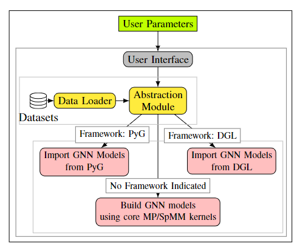

# gSuite

        
- gSuite is a flexible and framework independent benchmark suite for Graph Neural Networks at Inference level on GPUs.
- It allows researchers and engineers to build any desired GNN pipeline by just passing a few parameters to program.
- Choice can include using either a GNN framework (such as PyG and DGL) or our implementations, which are not dependent to any other ML libraries (such as PyTorch or Tensorflow).
  
Further information can be found in the paper:  
  
- [IEEE Xplore link](https://ieeexplore.ieee.org/document/9975401)  
- [arXiv link](https://arxiv.org/abs/2210.11601)

### Software Architecture

:warning: **This repository may contain out of date code chunks, which may lead compile to fail.**

### Usage
Just execute the main script by passing a few parameters (_see UI Parameters below_).  
Example usage:  
`python3 main.py --config "conf.json" --model "gcn" --dataset "cora"`

### UI Parameters
`--config`: (_mandatory_) local configuration file which includes default parameters  
`--gpu-id` : (_optional_) device id  
`--model` : (_optional_) GNN model  
`--dataset` : (_optional_) dataset to be processed  

### Before Compiling

#### volta lab
`export PATH=/okyanus/progs/cuda/cuda-10.1/bin:$PATH`  
`export CPATH=/okyanus/progs/cuda/cuda-10.1/include:$CPATH`  
`export LD_LIBRARY_PATH=$LD_LIBRARY_PATH/okyanus/progs/cuda/cuda-10.1/lib64/`  

#### pascal lab
`export PATH=/usr/local/cuda-8.0/bin:$PATH`  
`export CPATH=/usr/local/cuda-8.0/include:$CPATH`  
`export LD_LIBRARY_PATH=$LD_LIBRARY_PATH/usr/local/cuda-8.0/lib64/`  

### Profile via NVPROF
`nvprof -f --analysis-metrics -o cudaDataLoader.nvprof ./cudaDataLoader.o --benchmark`  

### lib compilation
`nvcc -lcublas -std=c++11 -c -arch=compute_61 cuBlasUtil.cu Data_Util.cu CU_GCN_MP.cu CU_SpMM_GCN.cu cudaDataLoader.cu --compiler-options -fPIC`  
`nvcc --shared -o libCU_SpMM_GCN.so cudaDataLoader.o cuBlasUtil.o Data_Util.o CU_SpMM_GCN.o --compiler-options -fPIC -std=c++11`  

### tests
indexSelect:  
`nvcc -g --cudart shared -lcublas_static -lculibos -ldl -lpthread -lcudart -lcudadevrt -std=c++11 -gencode arch=compute_61,code=compute_61 index_select.cu Data_Util.cu test/indexSelect_test.cu -o test/indexSelect_test.o`

linear:  
`nvcc -g --cudart shared -lcublas_static -lculibos -ldl -lpthread -lcudart -lcudadevrt -std=c++11 -gencode arch=compute_61,code=compute_61 linear.cu cuBlasUtil.cu Data_Util.cu test/linear_test.cu -o test/linear_test.o`

scatter (aggregation):  
`nvcc -g --cudart shared -lcublas_static -lculibos -ldl -lpthread -lcudart -lcudadevrt -std=c++11 -gencode arch=compute_61,code=compute_61 scatter_cuda.cu Data_Util.cu test/scatter_test1.cu -o test/scatter_test1.o`

scatter (node degrees):  
`nvcc -g --cudart shared -lcublas_static -lculibos -ldl -lpthread -lcudart -lcudadevrt -std=c++11 -gencode arch=compute_61,code=compute_61 scatter_cuda.cu Data_Util.cu test/scatter_test2.cu -o test/scatter_test2.o`
